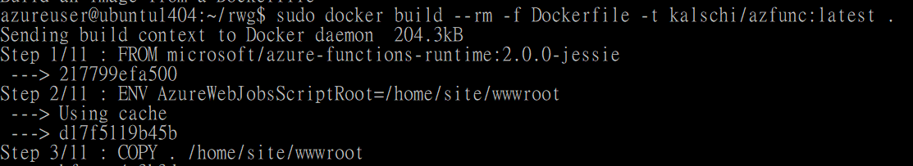
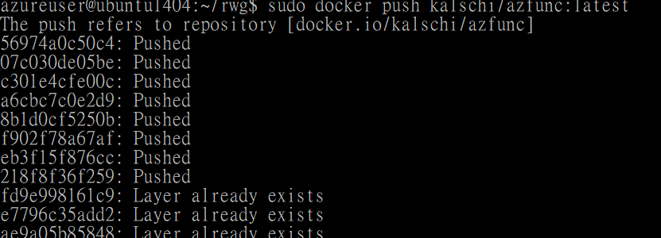
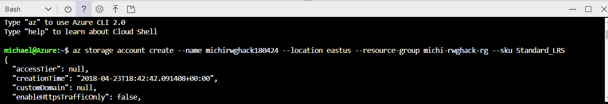
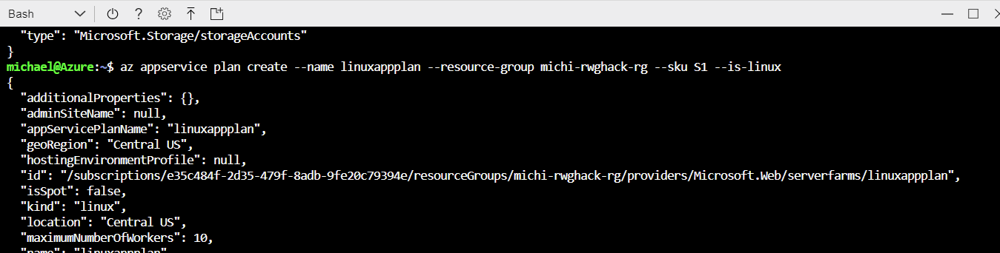
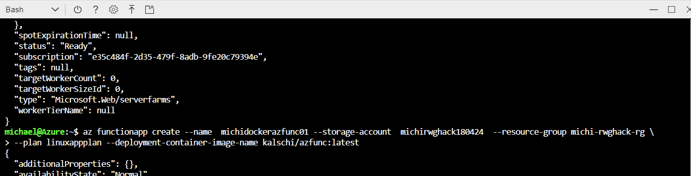
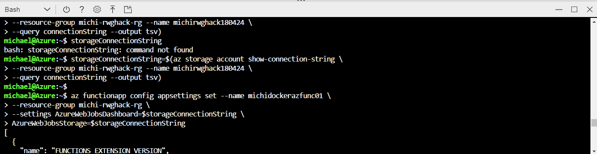
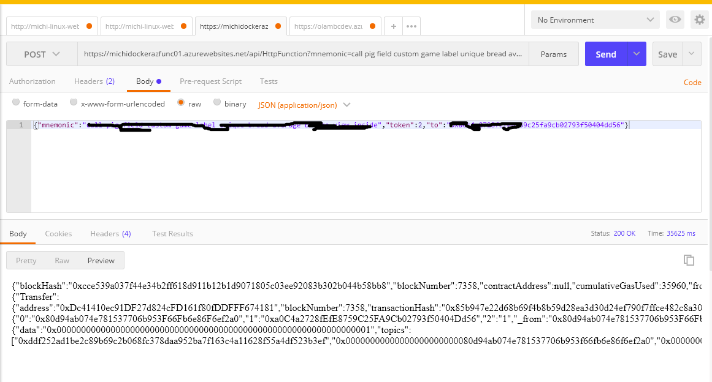

Overview
========

This document introduces how to create a Docker image that runs Web3.JS web
application and deploy to Azure Function App (Linux)

In this demo, we create a Node.Js Function App called “HttpFunction” which will
invoke web3.js to communicate with Ethereum Network.

Reference
=========

-   <https://docs.microsoft.com/en-us/azure/azure-functions/functions-create-first-azure-function-azure-cli-linux>

Create Docker Image
===================

-   At this moment, to create an Azure Function App container image, we have to
    start with official image “microsoft/azure-functions-runtime:2.0.0-jessie”
    which is an Ubuntu 14.04 based image. So we have to have an Ubuntu 14.04
    machine to build our container image.

-   Create a Ubuntu 14.04 Machine and ssh into it

-   Install [Docker
    CE](https://www.digitalocean.com/community/tutorials/how-to-install-and-use-docker-on-ubuntu-16-04)

-   Clone
    <https://github.com/michael-chi/blockchain-learning/tree/master/azfunc> to
    your local development environment

-   We start our Dockerfile with official Azure function Dockerfile, which
    contains only below codes:

\# Base the image on the built-in Azure Functions Linux image.
```
FROM microsoft/azure-functions-runtime:2.0.0-jessie

ENV AzureWebJobsScriptRoot=/home/site/wwwroot

\# Add files from this repo to the root site folder.

COPY . /home/site/wwwroot
```
-   First, we do apt-get update to update system
```
\# update

RUN apt-get update \\

&& apt-get install -y --no-install-recommends dialog \\

&& apt-get update
```
-   Then we install required packages, such as build-essential
```
RUN apt-get install -y git

\# build-essential & python

RUN apt-get install -y build-essential

RUN apt-get install -y python

RUN apt-get install -y curl
```
-   Install other packages
```
RUN apt-get update \\

&& apt-get install -y --no-install-recommends \\

curl \\

&& rm -rf /var/lib/apt/lists/\*
```
-   Finally, install required node packages. Note that in this demo, we have a
    Function App called “HttpFunction”, we will point npm to read package.json
    from HttpFunction folder and install required node.js package to
    HttpFunciton/node_modules folder.

>   We do this by specifying –prefix option to npm install command and supply
>   package.json path and destination path.
```
\# Node.Js dependencies

RUN mkdir -p /home/site/wwwroot/HttpFunction/node_modules

RUN npm install /home/site/wwwroot/HttpFunction --prefix
/home/site/wwwroot/HttpFunction
```
-   Complete Dockerfile can be found here:
    <https://github.com/michael-chi/blockchain-learning/blob/master/azfunc/Dockerfile>

-   Once ready, run below command to build our docker image
```
sudo docker build –rm -f Dcokerfile -t \<docker id\>/\<image name\>:\<tag\>
```
For example:
```
sudo docker build -rm -f Dockerfile -t kalschi/azfunc:latest
```


-   Push to Docker Hub by running docker push
```
sudo docker push \<docker id\>/\<image name\>:\<tag\>
```
For example
```
sudo docker push kalschi/azfunc:latest
```


Create Linux Function
=====================

In this step, we will be creating a Linux based Azure Function App. We will be
creating below resources

-   Resource Group: michi-hack-rg

-   Storage Account: michihack180424

-   Linux App Service Plan: linuxappplan

-   Function App: michidockerazfunc01

-   Go to Azure Portal and create a new Resource Group called michi-hack-rg

-   Open Cloud Shell from your Azure Portal


-   Execute below command to create a new Storage account for our Function App
```
   az storage account create --name michihack180424--location eastus
   --resource-group michi-rwghack-rg --sku Standard_LRS
```


-   Execute below command to create a Linux App Service Plan
```
az appservice plan create --name linuxappplan --resource-group michi-hack-rg
--sku S1 --is-linux
```


-   Create a Function App with our custom container image.
```
az functionapp create --name michidockerazfunc01 --storage-account
michihack180424 --resource-group michi-hack-rg --plan linuxappplan --deployment-container-image-name kalschi/azfunc:latest
```


-   Configure Storage Connection
```
storageConnectionString=\$(az storage account show-connection-string --resource-group michi-hack-rg --name michihack180424 --query connectionString --output tsv)

az functionapp config appsettings set --name michidockerazfunc01 --resource-group michi-hack-rg 
--settings AzureWebJobsDashboard=\$storageConnectionString 
AzureWebJobsStorage=\$storageConnectionString
```


-   Wait for Function App to be created successfully

-   Use Postman to test it out

POST
```
https://michidockerazfunc01.azurewebsites.net/api/HttpFunction?mnemonic=call pig
field custom game label unique bread average breeze view
inside&to=0xa0c4a2728fefe8759c25fa9cb02793f50404dd56&token=2
```


Known Issue
===========
- This demo can only accept Http Get