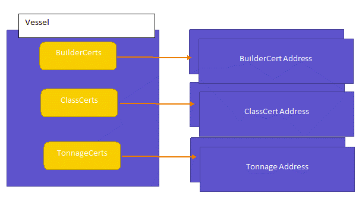

# Preparation #
===========

-   Download compiled [web3.js](https://github.com/ethereum/web3.js)

-   Download
    [pscp.exe](https://www.chiark.greenend.org.uk/~sgtatham/putty/latest.html)

-   Execute below command to copy file from your truffle environment in the
    cloud to your local machine

>   pscp azureuser\@\<TRUFFLE IP ADDRESS/DNS NAME\>:\<PATH TO YOUR TRUFFLE
>   OUTPUT FOLDER\>/\*.json

# Overview #
========

This sample demonstrate smart-contracts design for certificate scenario, when a
ship owner request to build a ship, he submit request to shipyard for Builder
certificate and once it is completed kick-off the rest certificate process.

Contracts are design as below, we use a Vessel contract to track different
certificates for different ships, each ship are identified by IMO number

In this sample, we do not hold certificate state such as Initiated, Singed in
contracts, but in some scenario you may want to hold certificate status in your
contract in order to track its state and decide what are available actions.
