Overview
========

This document introduces how to create a Docker image that runs Web3.JS web
application and deploy to Azure Web App (Linux)

Reference
=========

-   <https://docs.microsoft.com/en-us/azure/app-service/containers/tutorial-custom-docker-image>

Create Docker Image
===================

-   Create a Ubuntu 16.04 Machine and ssh into it

-   Install [Docker
    CE](https://www.digitalocean.com/community/tutorials/how-to-install-and-use-docker-on-ubuntu-16-04)

-   Clone
    <https://github.com/michael-chi/blockchain-learning/tree/master/hd-wallet/webapp>
    to your local development environment

-   [Dockerfile](https://github.com/michael-chi/blockchain-learning/blob/master/hd-wallet/webapp/Dockerfile)
    shows required packages and steps. In this Dockerfile, we

    -   Use official Node.Js 9.11 image as base image

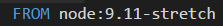

-   Install below node.js packages for our sample web app. (Listed in
    package.json)

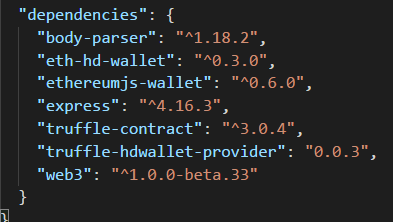

-   Expose TCP port 8000 and 2222, we will be using 8000 for our web app and
    2222 for ssh


-   Switch to cloned web app folder and execute below command to build our
    docker image

```
sudo docker build –tag \<YOUR DOCKER ID\>/linuxwebapp:0.5 .
```
For example, below’s my command
```
sudo docker build –tag kalschi/linuxwebapp:0.5 .
```
-   Once completed, run “sudo docker images” to check newly created image exists

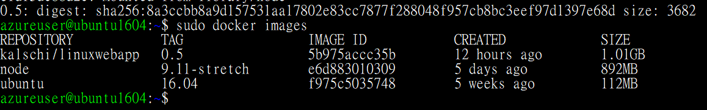

-   Once completed, login to Docker Hub by running
```
sudo docker login
```
-   Input your Docker Id (NOT Email) and Password to login to Docker hub
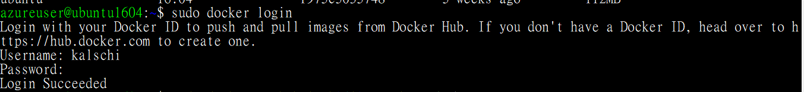

-   Execute below command to push your docker image to docker hub

```
sudo docker push \<YOUR DOCKER ID\>/linuxwebapp:0.5
```
- For example,

```
sudo docker push kalschi/linuxwebapp:0.5
```
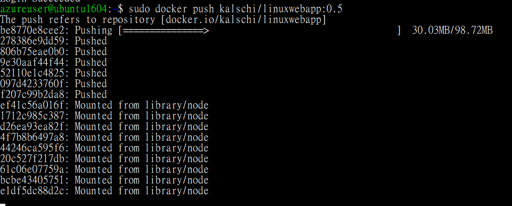

-   Once completed, verify pushed image in your docker hub.


Create Linux Web App Service Plan
=================================

-   Go to Azure Portal, create new App Service Plan

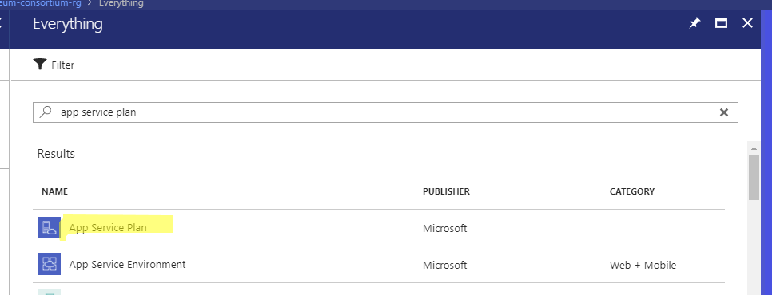

-   Choose Linux as Operation System

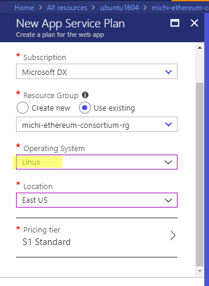

-   Once completed, Open Cloud Shell


-   Execute below command to create a new Linux Web App

```
az webapp create --resource-group \<RESOURCE GROUP NAME\> --plan \<YOUR PLAN
>   NAME\> --name \<WEB APP NAME\> --deployment-container-image-name \<DOCKER
>   IMAGE\>
```
For example,
```
az webapp create --resource-group michi-ethereum-consortium-rg --plan
   michi-linuxappservice-plan --name michi-linux-web3app
   --deployment-container-image-name kalschi/linuxwebapp:0.5
```
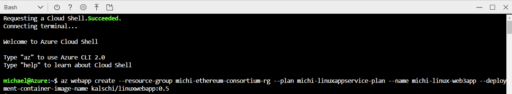

-   You should see below output

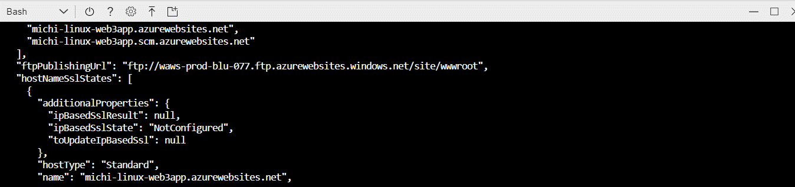

-   Execute below command to setup 8000 port as our internal communication port
    so that Web App forwards incoming request to this port which we exposes.
```
az webapp config appsettings set --resource-group \<RESOURCE GROUP NAME\>
>   --name \<WEB APP NAME\> --settings WEBSITES_PORT=8000
```
For example,
```
az webapp config appsettings set --resource-group
   michi-ethereum-consortium-rg --name michi-linux-web3app --settings
   WEBSITES_PORT=8000
```
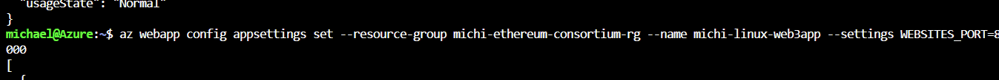

-   You should see below output
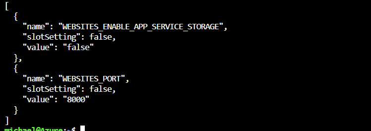

-   And it works!
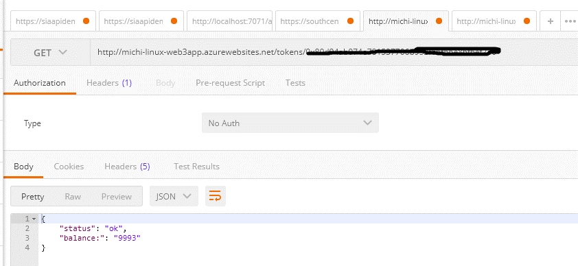
