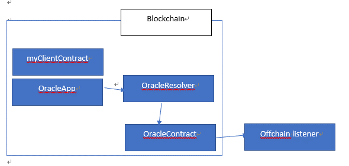
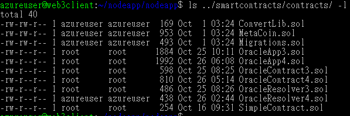
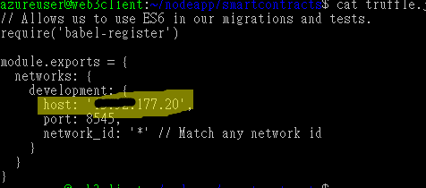
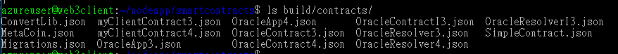
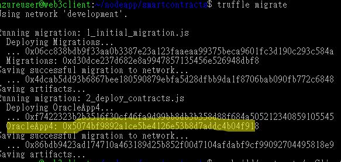
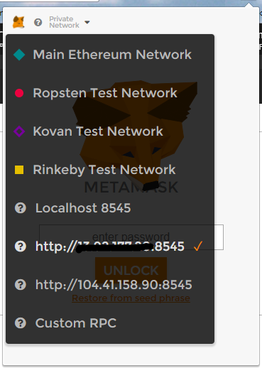
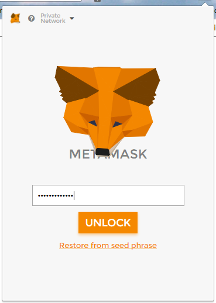
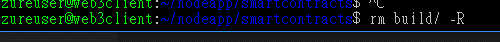
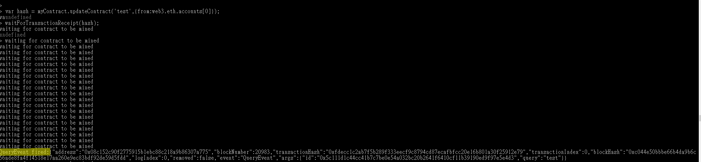

在Ethereum中，所有的資料都只在blockchain中流動，如果需要取得外部的資訊(例如天氣資料)，只能透過oracle跟外部溝通。在這篇文章我們不討論oracle的安全性議題，而專注在如何建立一個oracle，讓外部取得blockchain中發生的事件。

完整的oracle contract架構如下：

-   myClientContract”繼承”OracleApp合約

-   OracleResolver合約保存實際Oracle合約(OracleContract)的位址

-   OracleContract會trigger一個QueryEvent

-   Offchain listener會監控QueryEvent，如果此Event發生，則Offchain
    listener會收到通知，在這裡便可以將資料存到外部資料庫

步驟
----

所有的source
code都在Github上：<https://github.com/michael-chi/blockchain-learning/tree/master/oracle>

-   建立OracleContract.sol

pragma solidity \^0.4.10;

contract OracleContract4 {

address owner;

address public callbackAddress;

string public state;

event QueryEvent(bytes32 id, string query);

function OracleContract4 () {

owner = msg.sender;

}

modifier ownerOnly {

require(owner == msg.sender);

\_;

}

function setCallbackAddress(address \_callbackAddress) {

callbackAddress = \_callbackAddress;

}

function getRandomNumber() returns (uint) {

return 12;

}

function query(string \_query) returns (bytes32) {

bytes32 id = sha3(block.number, now, \_query, msg.sender);

QueryEvent(id, \_query);

return id;

}

}

其中query()這個function將提供給我們實際的合約呼叫；當此function被呼叫時，QueryEvent事件會被觸發，而我們的offchain
listener會監聽這個事件。

-   建立OracleResolver.sol

pragma solidity \^0.4.10;

contract OracleResolver4 {

address owner;

address public oracleAddress;

function OracleResolver4() {

owner = msg.sender;

}

modifier onwerOnly {

require(msg.sender == owner);

\_;

}

function setOracleAddress(address addr) {

oracleAddress = addr;

}

function getOracleAddress() constant returns (address) {

return oracleAddress;

}

}

-   建立完成後，我們要先將這兩個合約佈署到Ethereum上。這邊我們透過truffle來做佈署

    -   如果先前沒有安裝truffle，可以在Azure
        Marketplace直接建立安裝好truffle的虛擬機器。

    -   建立一個空的目錄後，執行truffle init webpack初始化truffle專案

    -   將剛剛建立好的.sol檔案copy到contracts目錄下

-   修改truffle.json檔案，將host改為你的Ethereum Transaction Node IP

-   執行truffle compile建置.sol檔案

-   建置完成後，會在目錄下建立一個新的build目錄，其下會有一個contracts目錄；在目錄中可以看到建置好的Json檔案。此檔案包含了合約的ABI定義以及Bytecode。

-   我們稍後會需要這些JSON檔案

-   建置完成後，我們需要修改migration/2_deploy_contracts.js這個檔案。這個檔案中會指定我們要佈署到Ethereum上的合約。將檔案修改如下：

var oracle = artifacts.require("../contracts/OracleContract4.sol");

var resolver = artifacts.require("../contracts/OracleResolver4.sol");

module.exports = function(deployer, network , accounts) {

deployer.deploy(oracle);

deployer.deploy(resolver);

};

-   回到console，執行truffle
    migrate將合約佈署到Ethereum上；你應該會看到類似以下的畫面表示佈署成功。

    -   把OracleContract以及OracleResolver的位址記下來，稍後我們會用到。

-   如果出現Authentication Neded:Password or
    unlock的錯誤；表示帳號未解鎖，必須解鎖才能進行動作。

    -   解鎖可以透過Chrome的MetaMask工具來解鎖；將RPC位址設定好後輸入帳號密碼即可解鎖帳號。

-   接著我們需要先把剛剛記錄下來的OracleContract位址與OracleResolver位址轉換為Checksum
    Address；我們可以透過以下的Node.JS程式進行轉換。

var tx = 'http://{TXNODE IP}:8545';

var passpharse = '{Password}';

var fs = require('fs');

var Web3 = require('web3');

var web3 = new Web3();

var oracleContractAddress =
'0x08c152C90F2775915B1EBC88C218A9B86307A775';//deployed contract checksum
address

var clientContractAddress = '0xc3a486e2c58d8b3713af5848eb4303dc7e81946b';

web3.setProvider(new web3.providers.HttpProvider(tx));

//unlock accounts that we'll be using

web3.personal.unlockAccount(web3.eth.accounts[0],passpharse,30000);

var checksum = web3.toChecksumAddress(oracleContractAddress);

-   將轉換完成的Checksum address記錄下來。

-   接著我們需要建立我們實際上要使用的合約；下面黃色的部分即是需要填上剛剛記錄下來的Checksum
    Address

    -   在這個SOL檔案中，我們建立了兩個合約：OracleApp4與myClientContract4。

    -   OracleApp4合約提供了實際上與Oracle溝通的方式；我們透過OracleResolver取得Oracle位址，並提供queryOracle方法給myClientContract4呼叫以與Oracle溝通。

    -   myClientContract4合約基本上沒有做什麼事情，只是提供了一些方法供調用測試。

pragma solidity \^0.4.10;

import "./OracleContract4.sol";

import "./OracleResolver4.sol";

//my client contract

contract OracleApp4 {

OracleResolver4 public resolver;

OracleContract4 public oracle;

function OracleApp4() {

resolver = OracleResolver4(0x444078Aa15FE48B152245744cBD16023B2444C0e);//change
the address to your OracleResolver.sol checksum address

resolver.setOracleAddress(0x08c152C90F2775915B1EBC88C218A9B86307A775);//change
the address to your Oracle.sol checksum address

oracle = OracleContract4(resolver.getOracleAddress());

}

modifier myOracleAPI {

\_;

}

modifier onlyFromCallback {

require(msg.sender == oracle.callbackAddress());

\_;

}

function queryOracle(string \_query) internal myOracleAPI returns(bytes32 id) {

return oracle.query(_query);

}

function \_callback(bytes32 \_id, string result) onlyFromCallback {

//callback function for offchain to call back

}

}

contract myClientContract4 is OracleApp4 {

address owner;

string public key;

string public state;

bytes32 id;

event OnCallBack(bytes32 \__id, string \__result);

// override

function \_callback(bytes32 \_id, string result) onlyFromCallback {

state = result;

OnCallBack(_id, result);

}

function updateContract(string \_state) myOracleAPI {

state = \_state;

queryOracle(_state);

}

function updateContract2(string \_state) myOracleAPI {

state = \_state;

}

function updateContract3(string \_state) myOracleAPI {

oracle.query(_state);

state = \_state;

}

function updateContract4(string \_state) myOracleAPI {

oracle.query(_state);

}

function updateContract5() myOracleAPI returns (uint) {

return oracle.getRandomNumber();

}

}

-   執行rm build/
    -R將上一次truffle建置的結果刪除；請注意，這個動作一定要做，否則稍後會無法佈署我們的新合約。

-   接著執行truffle compile與truffle
    migrate並將myClientContract4的部署位址記錄下來。

-   假如一切正常，那麼接下來我們就可以開始建立Offchain
    listener了；請注意黃色的部分是Oracle合約的Checksum address

'use strict';

/\*

OracleResolver4: 0x444078Aa15FE48B152245744cBD16023B2444C0e

OracleContract4: 0x08c152C90F2775915B1EBC88C218A9B86307A775

OracleApp4: 0x5074bf9892a1ce5be4126e53b8d7addc4b04f918

\*/

var tx = 'http://{TXNODE IP}:8545';

var passpharse = '{Password}';

var fs = require('fs');

var Web3 = require('web3');

var web3 = new Web3();

var oracleContractAddress =
'0x08c152C90F2775915B1EBC88C218A9B86307A775';//deployed contract checksum
address

var clientContractAddress = '0xc3a486e2c58d8b3713af5848eb4303dc7e81946b';

web3.setProvider(new web3.providers.HttpProvider(tx));

//unlock accounts that we'll be using

web3.personal.unlockAccount(web3.eth.accounts[0],passpharse,30000); //sender

web3.personal.unlockAccount(web3.eth.accounts[1],passpharse,30000); //oracle

function waitForTransactionReceipt(hash) {

console.log('waiting for contract to be mined');

const receipt = web3.eth.getTransactionReceipt(hash);

// If no receipt, try again in 1s

if (receipt == null) {

setTimeout(() =\> {

waitForTransactionReceipt(hash);

}, 1000);

} else {

// The transaction was mined, we can retrieve the contract address

console.log('contract address: ' + receipt.contractAddress);

//var result2 =
cf3.UpdateContract.sendTransaction('newState',1,{from:web3.eth.accounts[0]});

console.log('receipt=' + JSON.stringify(receipt));

}

}

//configure Oracle callback address

var text = fs.readFileSync('./contracts/OracleContract4.json','utf8');

var oracleInterface = JSON.parse(text);

var oracle = web3.eth.contract(oracleInterface.abi).at(oracleContractAddress);

//set callback address, this is the oracle account address, when oracle callback
to our contract, the caller address must match address specified here

var hash =
oracle.setCallbackAddress.sendTransaction(web3.eth.accounts[1],{from:web3.eth.accounts[1],gas:3000000});
//'0x1f83fa84c03a2f4e50be16947a3991cab6018376'

waitForTransactionReceipt(hash);

//convert clientContractAddress to checksum address

//clientContractAddress = web3.toChecksumAddress(clientContractAddress);

var queryEvent = oracle.QueryEvent();

console.log('watching for query event');

queryEvent.watch(function(err,result){

if(!err){

console.log('QueryEvent fired:' + JSON.stringify(result));

}else{

console.log('error=' + JSON.stringify(err));

}

});

text = fs.readFileSync('./contracts/myClientContract4.json','utf8');

var myContractInterface = JSON.parse(text);

var myContract =
web3.eth.contract(myContractInterface.abi).new({from:web3.eth.accounts[0],gas:3000000,data:myContractInterface.unlinked_binary});

-   執行程式後，Offchain listener就會開始監聽QueryEvent

-   我們可以透過node執行環境試著呼叫myClientContract4::updateContract看看

