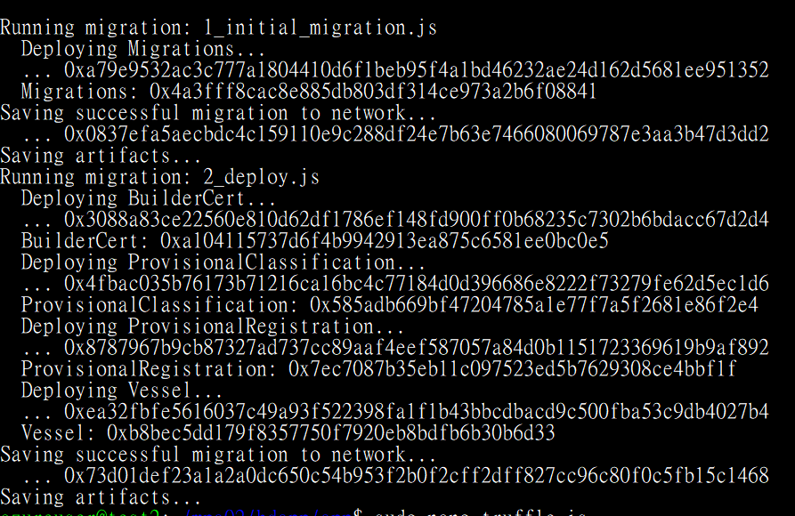
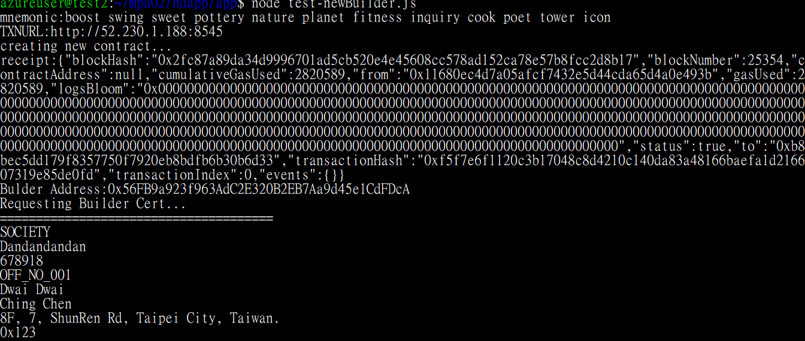

Overview
========

In this document we will be using POA ARM template to deploy a new Ethereum POA
network on Azure. Then we will use HD-Wallet-Provider to deploy smart contract
and interact with them.

Create Genesis Account
----------------------

1.  Goto <https://www.myetherwallet.com/>

2.  Enter desired password and click “Create New Wallet”


3.  Download safely keep KeyStore file. Once downloaded, click “I understand,
    Continue” to continue.


4.  Save private key


Deploy POA Network
------------------

5.  In this lab we are to create POA with this template:
    <https://github.com/EthereumEx/ethereum-arm-templates/blob/master/ethereum-consortium/template.clickOnce.PoA.json>

6.  Download template, open it with your favorite IDE, we will be changing
    several parameters

7.  Update PrivateKey and Address we created in above steps


8.  Depends on your scenario, you may want to change gaslimit when required.


9.  The template funds genesis account with this amount of ether, you can change
    that or add additional accounts when required.


10.  Goto Azure Portal, create a Template Deployment and paste modified ARM
    template json.


11.  Verify everything is correct then click Save

12.  Verify required information and give it a SSH public key. You can follow
    [this](https://www.ssh.com/ssh/putty/windows/puttygen) instruction or
    [this](https://help.github.com/articles/generating-a-new-ssh-key-and-adding-it-to-the-ssh-agent/)
    to create one.


13.  Once verified, click “Purchase” to continue. Take a rest, make yourself a
    cup of coffee, this can take up to an hour.

14.  Once created, open your resource group, looking for a VM scale-set whose
    name ended with “-tx”


15.  Open it up, and note the IP address or DNS name (if any)


Create and Fund our Account
---------------------------

We will be creating a new account and fund it as our default account in this
case. In this step we will be using MetaMask to fund our account, you can
probably write a script to make your life easier, but we really want to
demonstrate how existing tools helps you in this case.

16.  Ssh to your Ubuntu machine (Create on if not any). Download [source
    codes](https://github.com/michael-chi/blockchain-learning/tree/master/poa-and-hd-wallet)
    and do npm install to install dependencies.

17.  Run below command to create a new address, private key and mnemonic

```
   node createAccount.js
```


18.  Note down address, key and mnemonic, we will need them later.

19.  Go back to your working machine, open up Chrome.

20.  Install
    [MetaMask](https://chrome.google.com/webstore/detail/metamask/nkbihfbeogaeaoehlefnkodbefgpgknn)
    in Chrome

21.  If this is your first time login to MetaMask, you will be promoted to input
    a passphase. Give it a passphase, we don’t need it in this case.

22.  Clicke Network option and then click Custom RPC and update it with your IP
    address.


23.  Click Account menu item and then Import Account


24.  Enter your genesis account private key


25.  Name it Genesis Account


26.  Repeat above step to import the account we created in step 17 and name it
    HDWallet Account

27.  From Genesis Account, transfer Ether to HDWallet account. As we are to use
    HDWallet account to deploy smart contract and submit transaction…etc.

28.  Make sure your HDwallet account does have Ether before you go to next step.


Deploy Smart Contract
---------------------

29.  Ssh to your truffle box (create from Azure if not any). Run “truffle init”
    to create a new project, download [source
    codes](https://github.com/michael-chi/blockchain-learning/tree/master/poa-and-hd-wallet/smartcontracts)
    to newly created truffle folder


30.  Run “npm install” to install dependencies, specifically,
    truffle-hdwallet-provider.


31.  Open up truffle.js by running “sudo nano truffle.js”

32.  Add HD-Wallet dependency and mnemonic to beginning of the script. Note that
    the mnemonic is the HDWallet Account one we created in step 17


33.  Add new network. Note that in my template I have my gaslimit set to 6500000
    so here I specified a gas higher than default (4712388). In your case you
    probably can remove it.


34.  Save it

35.  Create or update migrations/2_deploy.js to specify smart contracts need to
    be deployed.


36.  Run below command to compile and deploy smart contracts
```
   truffle migrate --network poa
```


37.  Note down above contract address.

Run test scripts
----------------

38.  Open up config.js and modify parameters


-   TXNURL is the transaction node URL we noted from Azure Portal

-   ADMIN_ACCOUNT is the HDWallet Account address we created above

-   ADMIN_MNEMONIC is the HDWallet account mnemonic we created above

-   The rests are contract addresses, update accordingly

39.  Run below command to see how it works
```
   node test-newBuilderCert.js
```


Conclusion
==========

With POA template, the transaction time reduced from around 10-20 seconds to
around 3-5 seconds (depends on your genesis file configuration). Which probably
be a better fit to enterprise scenario in terms of performance.
